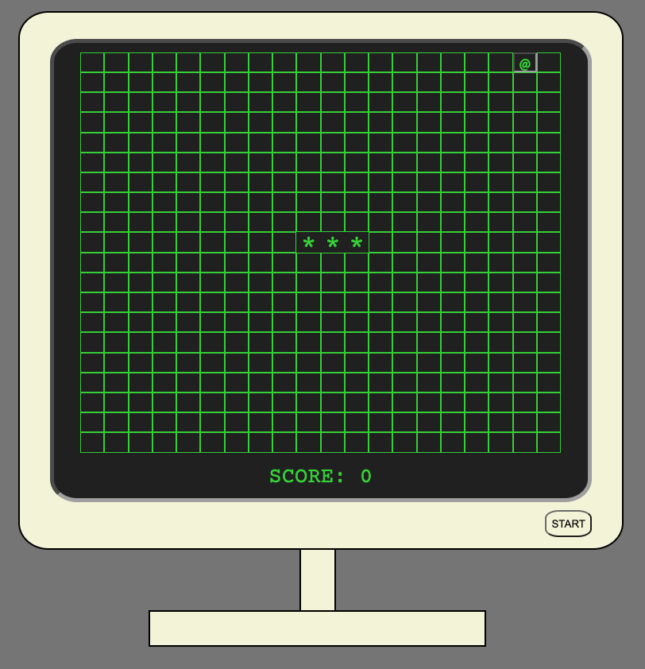

## RETRO SNAKE

---
Let's go back to the 80's for a bit. This was one of the first computer games that I ever played, and I'm sure that's true for a lot of people. I wanted to bring back that old-school feel. It is a complete recreation of the game that's been played for almost 40 years. Plus, don't you want to know if you're better than you were back then?

The game functions exactly as the original. You want to make your snake as long as possible! How do snakes grow longer? By eating apples, obviously. But be careful, it's game over when the snake hits itself or the boundary. 10 points a pop for the apples.

Can you gorge yourself on enough to fill the entire screen and get hundreds of points? Will you grow big enough to devour the world? Or will you stay a garden snake? Find out below!

### [Play Retro Snake](https://nate-snake.netlify.app/)

---
### Technical requirements:

- HTML
- CSS
- JavaScript
- Git

---
### Attributions:
##### Thanks so much to the creators of these assets!
1. Wireframe was created with [wireframe.cc](https://wireframe.cc/XR4iho)
2. Big thanks for the retro green font color found in the top answer of the post [here](https://superuser.com/questions/361297/what-colour-is-the-dark-green-on-old-fashioned-green-screen-computer-displays)
3. Used Google Fonts for [Courier Prime](https://fonts.google.com/specimen/Courier+Prime)
4. Another big thanks to [Feydi Montasar](https://www.artstation.com/artwork/Xn6E0y) for the beautiful favicon

---
### Planned future enhancements:

1. Create hard mode where the snake gets faster each time it gets an apple.
2. Create a golden apple worth 50 points that dissappears after 3 seconds.
3. Create Light/Dark mode by adding a desk and a lamp sitting behind the computer, with a toggle button on the pull hain for the lamp.
4. Create a keyboard and mouse.